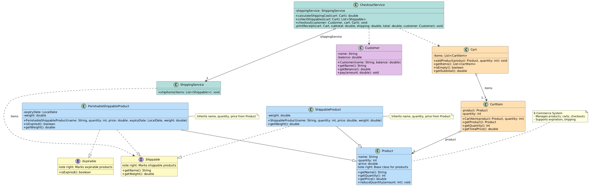
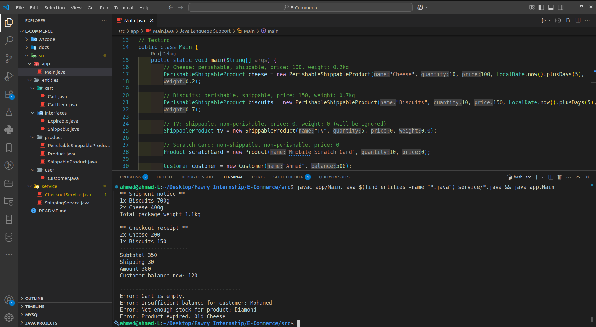

# E-Commerce System

This is the implementation of an e-commerce system built for the **Full Stack Development Internship Challenge**.  
The system manages products, shopping carts, and checkout operations with essential features like product expiration checks, shipping calculation, and customer balance validation.

---
## Project Structure

```
E-Commerce/
├── src/
│   ├── app/
│   │   └── Main.java
│   ├── entities/
│   │   ├── cart/
│   │   │   ├── Cart.java
│   │   │   └── CartItem.java
│   │   ├── interfaces/
│   │   │   ├── Expirable.java
│   │   │   └── Shippable.java
│   │   ├── product/
│   │   │   ├── Product.java
│   │   │   ├── ShippableProduct.java
│   │   │   └── PerishableShippableProduct.java
│   │   └── user/
│   │       └── Customer.java
│   └── service/
│       ├── CheckoutService.java
│       └── ShippingService.java
├── docs/
│   └── screenshot.png
└── README.md
```

## Features

- Define products with name, price, and available quantity.
- Support **perishable products** (e.g., Cheese, Biscuits) with expiration dates to ensure freshness.
- Support **shippable products** (e.g., Cheese, TV) with configurable weights, and **non-shippable items** (e.g., Mobile Scratch Card).
- Allow adding products to the cart with quantity checks against stock levels.
- Process checkout with clear calculation of **subtotal**, **shipping fees**, and automatic customer balance updates.
- Handle key edge cases: **empty cart**, **insufficient balance**, **out-of-stock items**, and **expired products**.

---

## Assumptions

- A flat shipping fee of **$30** applies if the cart contains any valid shippable items.
- Products with a **zero price** or **zero weight** may be excluded from receipts or shipment notices if applicable.

---

## Class Diagram



---

## Sample



---

## Installation

1. Clone this repository to your local machine.
2. Make sure Java is installed (**JDK 11** or newer recommended).
3. Open a terminal in the project root, then compile and run using:
   ```bash
   javac app/Main.java $(find entities -name "*.java") service/*.java && java app.Main
   ```
---
